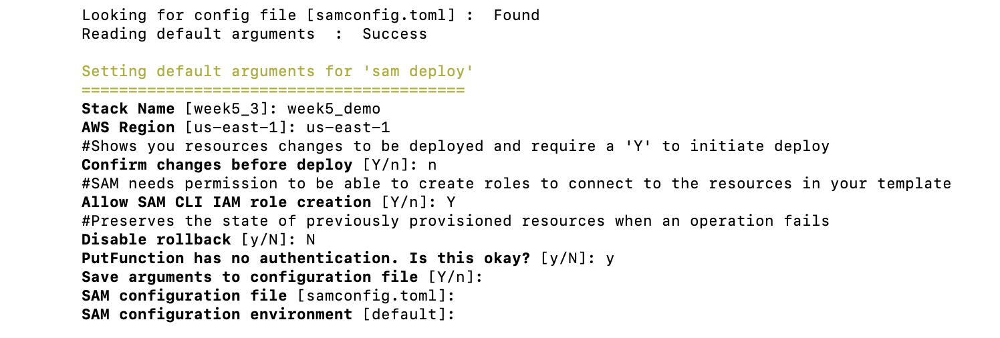

# Week 5 Mini Project

This Mini project does the following: 
* Create a Rust AWS Lambda function
* Implement a simple service
* Connect to a database

## Initial Steps

To be able to perform this, you must first set authentications and install required technologies.

### Required Installations: 
* Cargo/Rust (To confirm run: cargo --version)
* sam cli (To confirm run: sam --version)
    As an extension, aqw cli must be installed (and configured)
* cargo lambda (To confirm run: cargo lambda --help)

### Authentications
* Your AWS user account should have the following accesses (Full access for simplicity of the following categories):
    - apigateway
    - dynamoDB
    - s3
    - CloudFormation
    - IAM
    - Lambda

## Using AWS Serverless Application Model Command Line Interface (SAM CLI)
The SAM cli provides some automation as it relates to the creation of a lambda function and connecting to databases.

To start the SAM process, run sam init in your terminal.
Choose AWS quickstart and the dynamoDB template. 

At this point, update the template main.rs code however you like. My application just includes the "C" of CRUD database commands.

Run sam build and sam deploy -guided to deploy the application.

I chose the following options for the guided parameters.

Once you deploy, the SAM CLI will provide the following information.

As you can see, the SAM CLI created the following (order matters): 
* Dynamo DB Table
* API Gateway Rest API
* Lambda Function
* API Gateway Deployment and Stage
* Cloud Formation Stack

From Cloud Formation stack, we have the following outputs 

## Testing
I chose to use postman to confirm the lambda function is working - all you need is a free account.

To test, I used the link from the API Gateway line of the outputs. Knowing this is a put, I can enter "put" into postman and add a number (this is what we are adding to the database) at the end of the link. See below for confirmation it worked correctly.

## AWS Console

Below are screenshots from the AWS Console of the lambda function.

## References
* [rust-cli-template](https://docs.aws.amazon.com/serverless-application-model/latest/developerguide/sam-specification.html)
* [Using SAM](https://github.com/kbknapp/rust-cli-template)
